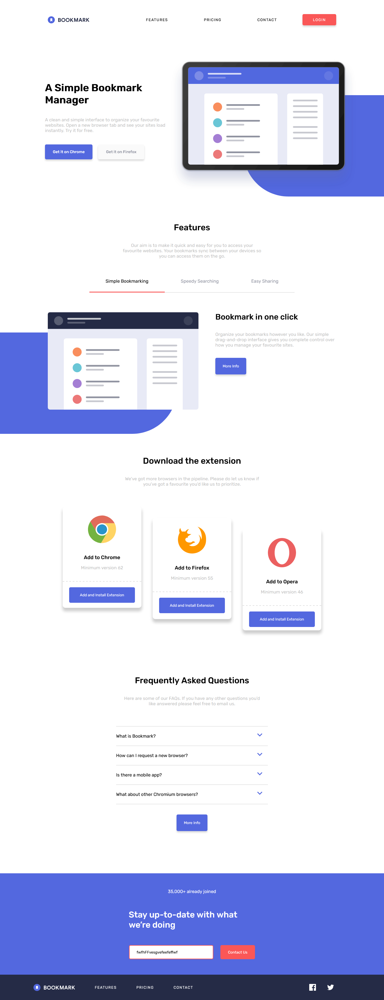

# Frontend Mentor - Bookmark landing page

## Welcome! 👋

Thanks for checking out this front-end coding challenge.

[Site Preview](blah) Site Preview

[Frontend Mentor](https://www.frontendmentor.io) provided with this challenge .

**To do this challenge, you need a basic understanding of HTML, CSS and JavaScript.**

## ScreenShots

### Desktop ScreenShots

 

### Mobile ScreenShots

<<<<<<< HEAD

 

=======
>>>>>>> e9db19d7f134ef399da2d5cfa236b82263dbc88b

 

## The challenge

Your challenge is to build out this landing page and get it looking as close to the design as possible.

You can use any tools you like to help you complete the challenge. So if you've got something you'd like to practice, feel free to give it a go.

Your users should be able to:

- View the optimal layout for the site depending on their device's screen size
- See hover states for all interactive elements on the page
- Receive an error message when the newsletter form is submitted if:
  - The input field is empty
  - The email address is not formatted correctly

For this challenge you'll need to:

- Create the rounded blue background shape with code
- Change the `fill` and `stroke` color of the SVGs at specific points (the challenge can be completed using the single `logo-bookmark.svg` file provided)

Want some support on the challenge? [Join our Slack community](https://www.frontendmentor.io/slack) and ask questions in the **#help** channel.

**Have fun building!** 🚀
"# fm-bookmark" 
